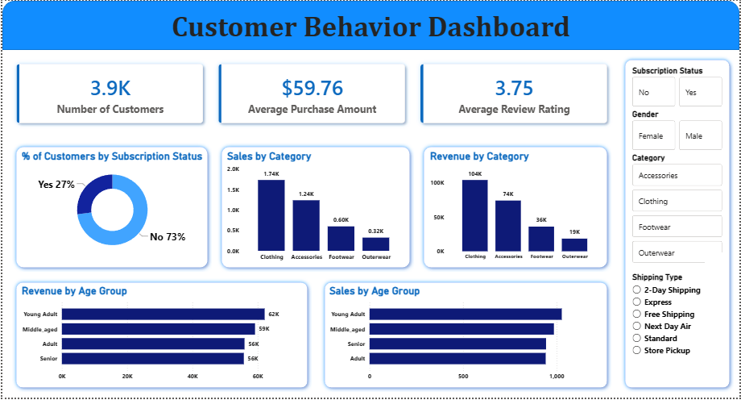

#  Markets Customer Analysis

An end-to-end **Customer Behavior Analysis** project built using **Python**, **MySQL**, and **Power BI**. This project focuses on analyzing customer purchasing behavior, cleaning and transforming raw data, storing processed data in a MySQL database, and creating an interactive dashboard for business insights.

---

## * Project Overview *

Businesses generate large amounts of customer data every day. This project demonstrates how data analytics can be used to extract meaningful insights from customer transactions and purchasing behavior.

The project includes:

- Data Cleaning and Preprocessing using Python
- Exploratory Data Analysis
- Database Integration with MySQL
- Interactive Dashboard Development using Power BI
- Business Insight Generation

---

## * Objectives *

- Analyze customer purchasing behavior.
- Clean and preprocess customer data.
- Store processed data in MySQL.
- Visualize customer insights using Power BI.
- Support data-driven business decision-making.

---

## * Tech Stack *

| Technology | Purpose |
|------------|---------|
| Python | Data Analysis & Preprocessing |
| Pandas | Data Manipulation |
| NumPy | Numerical Operations |
| MySQL | Database Management |
| Power BI | Dashboard & Reporting |
| Jupyter Notebook | Development Environment |

---

## * Repository Structure

```
markets_customer_analysis/
|
├── analysis_dashboard.png
├── customer_behavior_analysis.ipynb
├── market_customer_dashboard.pbix
├── market_customer_database.sql
└── README.md
```

---

## * Dashboard Preview *

> **Customer Behavior Dashboard**



The Power BI dashboard provides an interactive view of customer purchasing behavior and sales performance.

### Dashboard Highlights

- Sales by Category
- Revenue by Category
- Revenue by Age Group
- Sales by Age Group
- Subscription Status Analysis
- Interactive Filters
  - Gender
  - Category
  - Subscription Status
  - Shipping Type

---

## * Key Insights *

- Identified customer purchasing patterns.
- Compared sales across product categories.
- Analyzed revenue generated by different age groups.
- Measured customer subscription trends.
- Created an interactive dashboard for business reporting.

---

## * Skills Demonstrated *

- Data Cleaning
- Data Preprocessing
- Exploratory Data Analysis (EDA)
- SQL
- Database Management
- Power BI Dashboard Development
- Business Intelligence
- Data Visualization
- Analytical Thinking

---

## * Future Improvements

- Integrate real-time data sources.
- Add customer churn prediction using Machine Learning.
- Deploy dashboards using Power BI Service.
- Automate ETL processes.

---

## * Author

**Sourik**

- GitHub: https://github.com/sourik2002

---

## * If you found this project helpful, consider giving it a star!